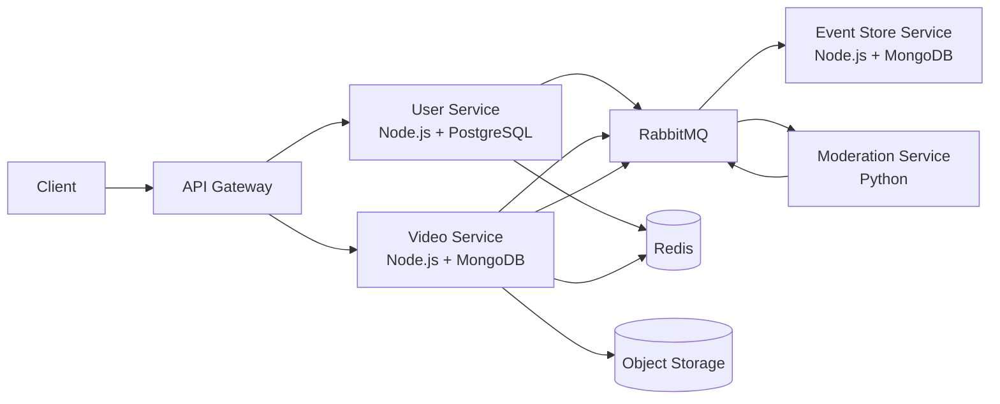
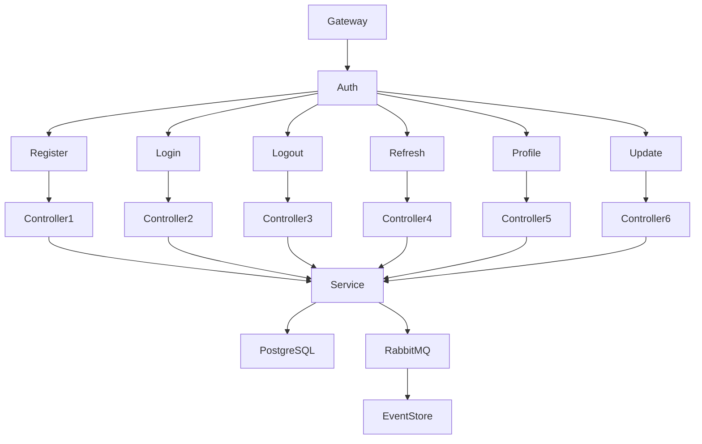
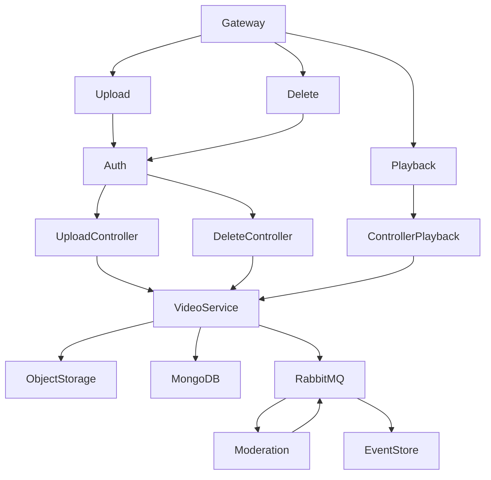
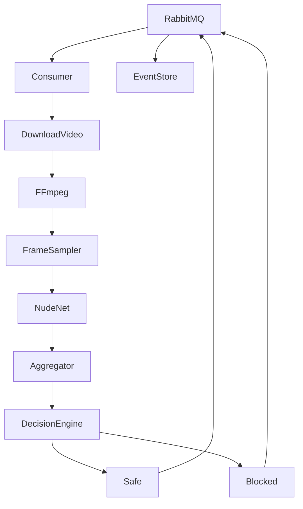
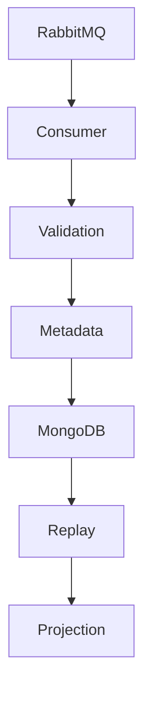
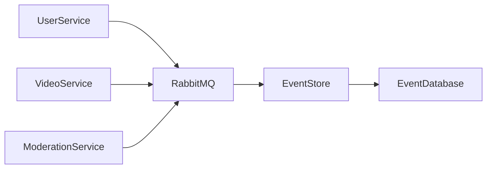
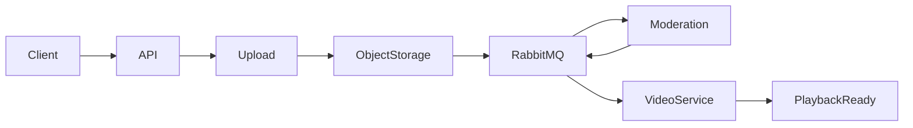
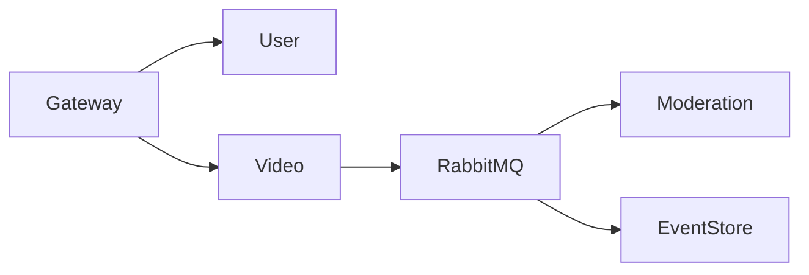

# VidMod - High Level Design (HLD)

This document contains the High Level Design (HLD) diagrams for the VidMod distributed video hosting platform.

---

# 1. Overall System Architecture



---

# 2. User Service



---

# 3. Video Service



---

# 4. Moderation Service



---

# 5. Event Store Service



---

# 6. Event Flow



---

# 7. Upload Pipeline



---

# 8. Authentication Flow

```mermaid
flowchart LR

Client

--> API Gateway

--> User Service

--> PostgreSQL

User Service

--> RabbitMQ

RabbitMQ

--> Event Store
```

---

# 9. Moderation Pipeline

```mermaid
flowchart LR

VideoUploaded

--> RabbitMQ

--> Consumer

--> Download

--> FFmpeg

--> Sample Frames

--> NudeNet

--> Aggregate

--> Decision

Decision

--> Safe

Decision

--> Blocked

Safe --> RabbitMQ

Blocked --> RabbitMQ
```

---

# 10. Service Communication



---

# Legend

| Component | Description |
|-----------|-------------|
| API Gateway | Entry point for all client requests |
| User Service | Authentication & User Management |
| Video Service | Upload, Playback, Metadata |
| Moderation Service | AI-powered NSFW Detection |
| Event Store | Immutable Event Sourcing Database |
| RabbitMQ | Asynchronous Message Broker |
| Redis | Cache & Rate Limiting |
| PostgreSQL | User Database |
| MongoDB | Video Metadata & Event Store |
| Object Storage | Video File Storage (S3 / MinIO) |
