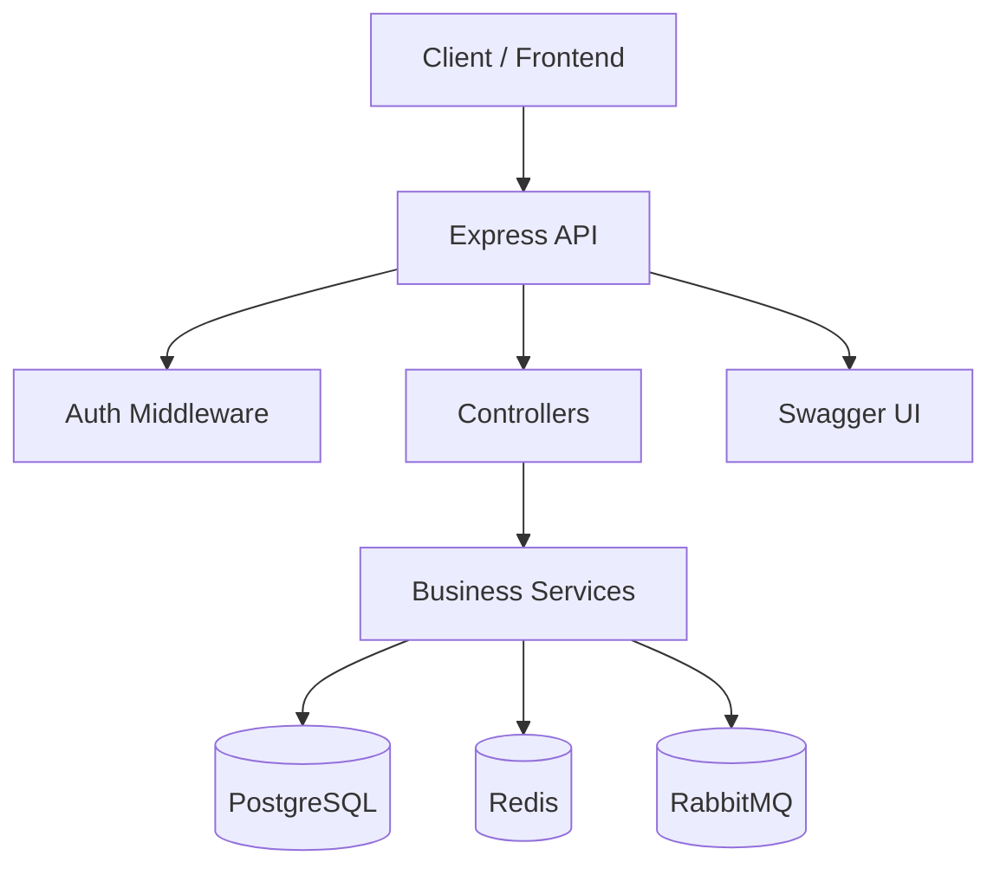

# VidMod User Service

The User Service is the authentication and account-management backbone of VidMod. It handles user registration, login, token refresh, logout, profile access, and email verification while integrating with PostgreSQL, Redis, RabbitMQ, and Swagger.

## 1. Overview

This service is built with:
- Node.js + TypeScript
- Express.js
- Drizzle ORM with PostgreSQL
- Redis for session and OTP storage
- RabbitMQ for event-driven communication
- JWT-based access/refresh authentication
- Swagger for API documentation

It exposes a set of REST APIs under the root path and is intended to support the broader VidMod platform through asynchronous events.

---

## 2. What this service does

The User Service is responsible for:
- Creating and managing users
- Authenticating users with email/password
- Issuing and rotating JWT access and refresh tokens
- Maintaining refresh-token sessions in Redis
- Generating and verifying OTPs for email verification
- Publishing domain events for other services to react to
- Providing a health endpoint for service checks

---

## 3. Core architecture



### Main layers
- Routes: define the public HTTP endpoints
- Controllers: parse requests and format responses
- Services: contain the business logic
- Middlewares: validate tokens and attach authenticated user info
- DB layer: handles persistence through Drizzle ORM
- Redis layer: manages temporary session and OTP data
- RabbitMQ layer: publishes events for other services

---

## 4. Project structure

```text
src/
  app.ts                 # Express app setup
  server.ts              # Starts the HTTP server and dependencies
  index.ts               # Drizzle DB client
  configs/               # Env, DB, Redis, RabbitMQ configuration
  controller/            # HTTP request handlers
  services/              # Core business logic
  routes/                # Route definitions
  middlewares/           # Auth and error handling
  db/                    # Schema definitions
  rabbitmq/              # Event publish/subscribe helpers
  utils/                 # Shared helpers and auth utilities
  swagger/               # Swagger docs configuration
  tests/                 # Test cases
```

---

## 5. Runtime flow

### 5.1 Application startup

When the service starts:
1. The Express application is created.
2. Middleware such as CORS, Helmet, JSON parsing, and cookie parsing are installed.
3. Redis is connected.
4. RabbitMQ is connected and the topic exchange is initialized.
5. The HTTP server starts listening on the configured port.

### 5.2 Request lifecycle

A typical request follows this pattern:
1. Request reaches the route.
2. Validation middleware may inspect the body.
3. Controller invokes the appropriate service.
4. Service accesses PostgreSQL, Redis, or RabbitMQ.
5. Response is returned to the client with the correct status code.
6. Errors are routed through the global error middleware.

---

## 6. API endpoints

All endpoints are mounted under the main router and exposed through the Express app.

### Authentication routes

#### POST /auth/register
Creates a new user account.

Request body:
```json
{
  "name": "Ayush Sharma",
  "email": "ayush@example.com",
  "password": "Password@123",
  "gender": "male"
}
```

Response body:
```json
{
  "success": true,
  "message": "User registered successfully.",
  "user": {
    "publicId": "<uuid>",
    "name": "Ayush Sharma",
    "email": "ayush@example.com",
    "gender": "male",
    "isVerified": false
  },
  "accessToken": "<jwt-access-token>"
}
```

Response cookie:
```text
vidmod_userservice_cookie=<refresh-token>; HttpOnly; SameSite=Lax/None
```

#### POST /auth/login
Authenticates an existing user.

Request body:
```json
{
  "email": "ayush@example.com",
  "password": "Password@123"
}
```

Response body:
```json
{
  "success": true,
  "message": "User logged in successfully.",
  "user": {
    "publicId": "<uuid>",
    "name": "Ayush Sharma",
    "email": "ayush@example.com",
    "gender": "male",
    "isVerified": false
  },
  "accessToken": "<jwt-access-token>"
}
```

#### POST /auth/refresh
Refreshes an access token using the refresh token from the cookie.

Request:
- No JSON body is required
- Expects the refresh token in the cookie named `vidmod_userservice_cookie`

Response body:
```json
{
  "success": true,
  "message": "Token refreshed successfully.",
  "accessToken": "<new-jwt-access-token>"
}
```

Response cookie:
```text
vidmod_userservice_cookie=<new-refresh-token>; HttpOnly; SameSite=Lax/None
```

#### POST /auth/logout
Logs the user out by invalidating the refresh session.

Request:
- No JSON body is required
- Expects the refresh token in the cookie named `vidmod_userservice_cookie`

Response body:
```json
{
  "success": true,
  "message": "User logged out successfully."
}
```

### Account routes

#### GET /account/profile
Returns the authenticated user's profile information.

Request headers:
```http
Authorization: Bearer <access_token>
```

Response body:
```json
{
  "success": true,
  "message": "User profile fetched successfully.",
  "user": {
    "publicId": "<uuid>",
    "name": "Ayush Sharma",
    "email": "ayush@example.com",
    "verified": false
  }
}
```

#### POST /account/generate-otp
Sends an OTP to the authenticated user's email for verification.

Request headers:
```http
Authorization: Bearer <access_token>
```

Response body:
```json
{
  "success": true,
  "message": "Verification OTP sent successfully.",
  "email": "ayush@example.com",
  "mail": {
    "messageId": "<smtp-message-id>",
    "accepted": ["ayush@example.com"],
    "rejected": []
  }
}
```

#### POST /account/verify-otp
Confirms the OTP supplied by the authenticated user.

Request headers:
```http
Authorization: Bearer <access_token>
```

Request body:
```json
{
  "otp": "123456"
}
```

Response body:
```json
{
  "success": true,
  "message": "User verified successfully.",
  "isVerified": true
}
```

### Health route

#### GET /health/
Returns a simple health response for monitoring and deployment checks.

---

## 7. Authentication model

### JWT tokens
The service uses two token types:
- Access token: short-lived, used for protected API access
- Refresh token: longer-lived, stored in Redis and used to rotate sessions

Token claims include:
- publicId
- name

JWT settings are defined in the auth utilities.

### Cookie-based refresh handling
Refresh tokens are stored in an HTTP-only cookie named:
```text
vidmod_userservice_cookie
```

This improves security by preventing the browser from exposing the token to JavaScript.

---

## 8. Data storage

### PostgreSQL
The PostgreSQL database is the source of truth for user records.

The main user schema includes:
- id
- publicId
- name
- email
- password (hashed)
- gender
- isVerified
- createdAt
- updatedAt
- deletedAt
- lastLoginAt
- emailVerifiedAt

### Redis
Redis is used for temporary state:
- Refresh-token sessions
- OTP codes

The Redis keys are prefixed to keep them organized and easy to inspect.

### RabbitMQ
RabbitMQ is used for event-driven communication.

The exchange name is:
```text
vidmod.events
```

The service publishes events such as:
- user.register.init / success / failed / error
- user.login.init / success / failed / error
- user.refresh.init / success / failed / error
- user.logout.init / success / failed / error
- user.email.otp.init / success / failed / error
- user.email.otp.verification.init / success / failed / error

These events allow other backend services to react without tight coupling.

---

## 9. Environment variables

The service expects the following environment values:

```env
PORT=4001
DATABASE_URL=postgresql://...
REDIS_HOST=localhost
REDIS_PASSWORD=...
REDIS_PORT=6379
NODE_ENV=development
JWT_ACCESS_TOKEN=...
JWT_REFRESH_TOKEN=...
SMTP_USER=...
SMTP_PASSWORD=...
SMTP_HOST=...
SMTP_PORT=587
SMTP_SECURE=true
MAIL_FROM=...
RABBITMQ_URI=amqp://localhost
ORIGIN_URI=http://localhost:5173
```

> Note: The current runtime configuration reads the mail sender value from the environment variable used by your deployment setup. Make sure the value is available consistently for email delivery.

---

## 10. Available scripts

From the service directory, use:

```bash
npm install
npm run dev
```

Useful commands:

```bash
npm run test
npm run test:coverage
npm run lint
npm run lint:fix
npm run db:generate
npm run db:migrate
npm run db:push
npm run db:studio
npm run db:drop
```

---

## 11. Swagger documentation

Swagger UI is available at:
```text
http://localhost:4001/api-docs
```

This provides a convenient way to inspect and test the API endpoints during development.

---

## 12. Error handling

Errors are handled centrally through the global error middleware.

The service uses a custom AppError class so that:
- business failures return appropriate status codes
- unexpected failures are normalized into a consistent response structure
- development mode can expose stack details for debugging

---

## 13. Security considerations

The service already implements several important safeguards:
- Password hashing with Argon2
- JWT-based authentication
- HTTP-only cookies for refresh tokens
- Helmet middleware for security headers
- CORS configuration
- Input validation for auth endpoints

For production deployment, ensure you also:
- use strong secret keys
- configure TLS and secure cookie settings properly
- protect Redis and RabbitMQ endpoints
- rotate secrets regularly

---

## 14. Typical user journey

A common authentication flow is:
1. User registers via /auth/register
2. Service stores the user and issues tokens
3. User logs in via /auth/login
4. Access token is used for protected routes
5. Refresh token is rotated through /auth/refresh
6. User verifies email via OTP generation and verification flow
7. User logs out and the session is removed from Redis

---

## 15. Summary

The VidMod User Service is a secure, event-driven authentication and account-management service that combines:
- Express for API handling
- Drizzle ORM for persistence
- Redis for short-lived credentials and OTPs
- RabbitMQ for decoupled event communication
- JWT and cookie-based authentication for modern session handling

It is designed to serve as the identity and account layer for the broader VidMod ecosystem.
