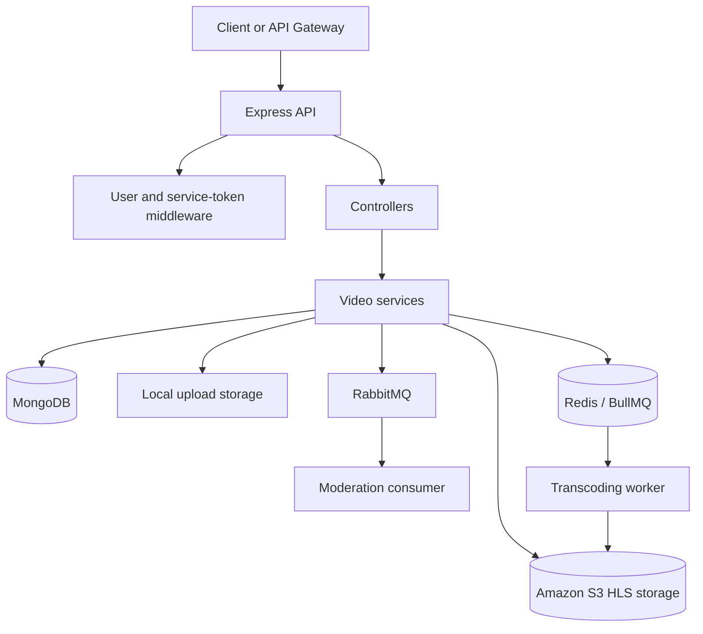

# VidMod Video Service

The Video Service handles video upload, moderation handoff, transcoding, HLS playback, service access tokens, and video deletion for VidMod.

## Responsibilities

- Accept supported video uploads and stage them on local storage.
- Queue uploaded videos for moderation and transcoding.
- Store video metadata in MongoDB.
- Store generated HLS playlists and segments in Amazon S3.
- Serve public HLS master playlists, quality playlists, and MPEG-TS segments.
- Issue and rotate service access tokens for trusted callers.
- Delete video metadata and associated storage through the delete workflow.

## Architecture



The HTTP server starts only after Redis, MongoDB, RabbitMQ, and the moderation consumer have been initialized. Transcoding runs separately through the worker process.

## Project structure

```text
src/
  app.ts                  Express middleware and route registration
  server.ts               Service startup and dependency initialization
  configs/                Environment, MongoDB, Redis, and upload configuration
  consumers/              RabbitMQ consumers
  controllers/            HTTP request handlers
  middlewares/            User and video-service access authentication
  models/                 MongoDB models
  queues/                 BullMQ queue configuration
  rabbitmq/               RabbitMQ configuration and event handling
  routes/                 HTTP route definitions
  services/               Upload, visibility, deletion, and S3 workflows
  transcode/              Transcoding worker and HLS generation
  utils/                  Logging, authentication, errors, and S3 helpers
```

## Prerequisites

- Node.js with npm
- MongoDB
- Redis
- RabbitMQ
- An Amazon S3 bucket, or an S3-compatible service
- FFmpeg available to the transcoding worker

Redis and RabbitMQ can be started from the backend directory:

```bash
docker compose up -d redis rabbitmq
```

## Installation and running

From `backend/videoService`:

```bash
npm install
npm run video-dev
```

Start the transcoding worker in a second terminal:

```bash
npm run worker
```

For a production-style TypeScript check and lint:

```bash
npm run lint
```

The service listens on the port configured by `PORT`.

## Environment variables

Create a `.env` file in `backend/videoService`:

| Variable | Purpose |
| --- | --- |
| `PORT` | HTTP server port |
| `NODE_ENV` | Runtime environment |
| `ORIGIN_URI` | Allowed frontend origin |
| `MONGOURI` | MongoDB connection string |
| `REDIS_HOST` | Redis host |
| `REDIS_PORT` | Redis port |
| `REDIS_PASSWORD` | Redis password |
| `RABBITMQ_URI` | RabbitMQ connection URI |
| `MAX_VIDEO_SIZE` | Maximum upload size in bytes |
| `VIDEO_STORAGE_PATH` | Local directory used for incoming uploads |
| `JWT_ACCESS_TOKEN` | Secret used to validate VidMod user access tokens |
| `VIDEO_ACCESS_SECRET` | Secret used to validate video-service access tokens |
| `S3_ACCESS_KEY` | S3 access key |
| `S3_SECRET_ACCESS_KEY` | S3 secret key |
| `s3_REGION` | S3 region; the current configuration reads this exact name |
| `s3_BUCKET_NAME` | S3 bucket; the current configuration reads this exact name |

Keep secrets out of source control. The upload directory is created automatically when the service starts.

## API

The service routes below are mounted at `/` when accessed directly. An API gateway may expose them under a prefix such as `/api/v1/videos`.

### Service access tokens

Both endpoints require a VidMod user JWT in the `Authorization` header.

```http
Authorization: Bearer <user-access-token>
```

#### `POST /generate-access`

Creates a one-time video-service access token for the authenticated user. Returns `201` and an `AccessToken` value. A token must not already exist for the user.

#### `POST /regenerate-access`

Replaces an existing video-service access token. Returns `201` and the new `AccessToken` value.

### Upload and deletion

#### `POST /upload`

Requires a video-service access token:

```http
Authorization: Bearer <video-service-access-token>
Content-Type: multipart/form-data
```

Send one file using the multipart field name `video`. Supported MIME types are:

- `video/mp4`
- `video/webm`
- `video/x-matroska`
- `video/quicktime`

A successful upload returns `202` and queues the video for moderation.

#### `DELETE /:videoId`

Requires a VidMod user JWT and deletes the specified video through the deletion service.

### HLS playback

Playback endpoints expose public videos only:

| Endpoint | Description |
| --- | --- |
| `GET /:videoId/master` | Returns the master HLS playlist |
| `GET /:videoId/:quality/index.m3u8` | Returns a quality-specific HLS playlist |
| `GET /:videoId/:quality/:segment` | Streams an MPEG-TS segment |

Example direct playback request:

```text
GET /<video-id>/master
```

The master playlist references quality playlists, and each quality playlist references segment endpoints. Videos that are not public return `404`.

## Processing flow

1. The client requests a video-service access token using a user JWT.
2. The client uploads a supported video with that token.
3. The service stores the upload locally and queues it for moderation.
4. Moderation and transcoding produce the video metadata and HLS assets.
5. HLS playlists and segments are written to S3 under `hls/<videoId>/`.
6. Public playback is served through the master playlist, quality playlists, and segments.

## Related services

- `userService` authenticates users and issues user JWTs.
- `moderationService` consumes moderation work and reports results.
- `eventstoreService` stores domain and infrastructure events.
- `gateway` provides the public API entry point for frontend clients.
